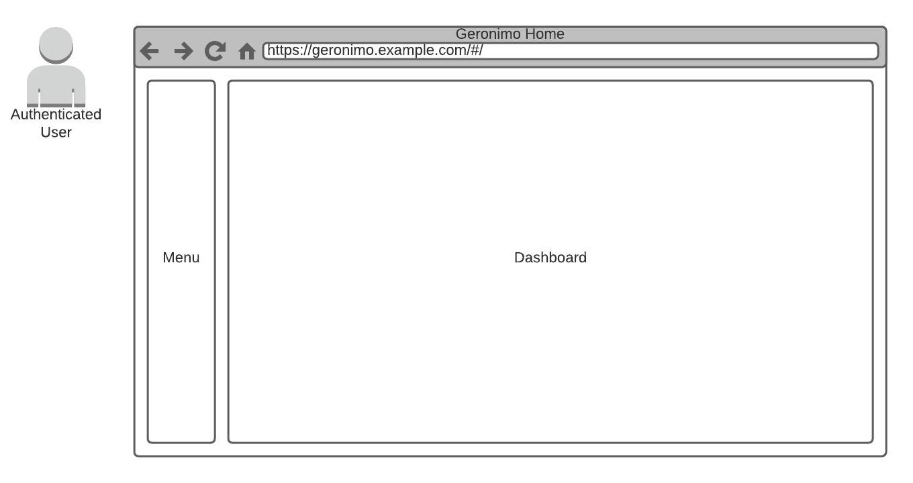
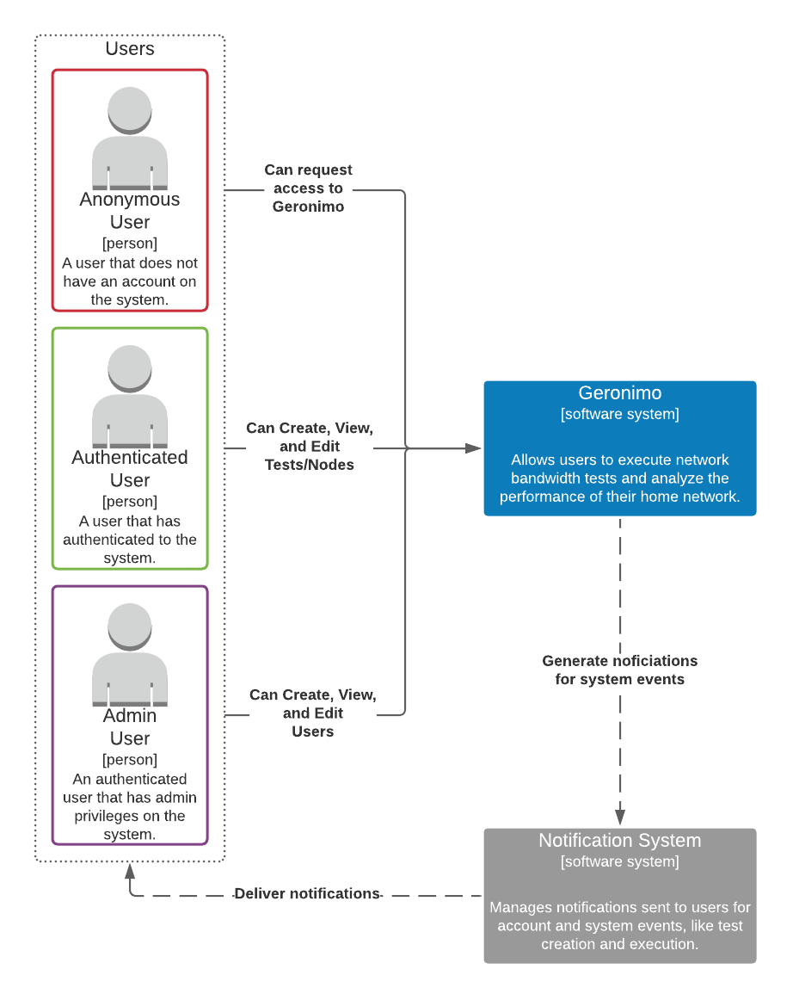
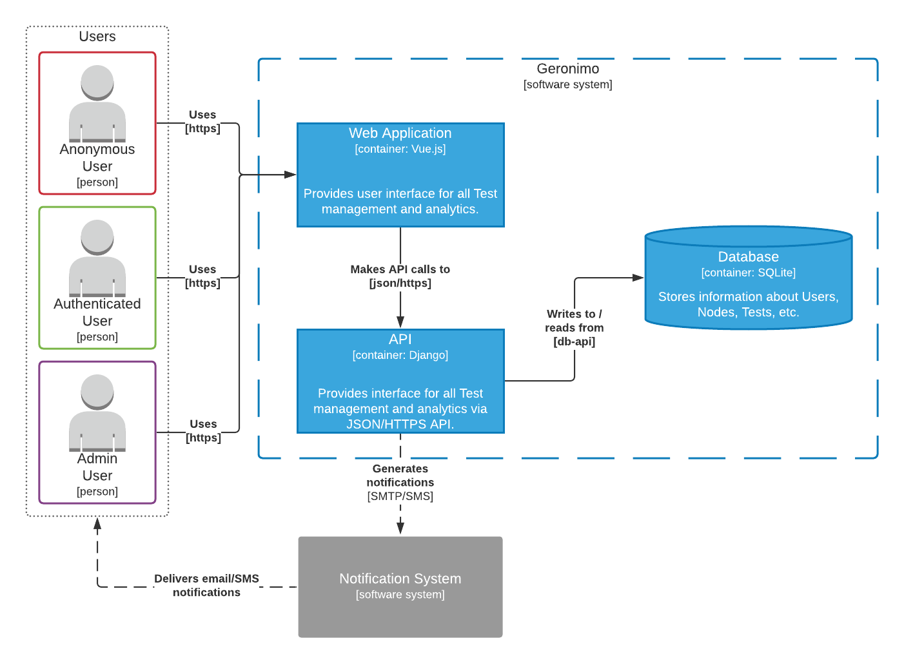

# User Stories
- As a **Viewer**, I want to **view historical Tests** so I can **analyze a network's bandwidth over time**.
  - *Given I'm a Viewer and I'm on the Tests page, When I define search/filter criteria for historical Tests, Then the system presents Tests based on provided criteria.*
- As an **Executor**, I want to **execute ad-hoc and scheduled Tests** so I can **analyze a network's real-time bandwidth**.
  - *Given I'm an Executor and I'm on the Create Test page, When I define parameters of a Test and click 'Submit', Then the system sends me a notification for the Test's creation, executes the Test as defined, and sends me a notification for the Test's execution.*
- As an **Administrator**, I want to **manage application users and their access** so I can **grant and revoke access to the application based on user needs**.
  - *Given I'm an Administrator and I'm on the User Management page, When I grant/revoke application user access, Then the system applies updated access controls to current and future application user sessions.*

# Mis-User Stories
- As a **mis-user**, I want to **view historical Tests** so I can **gather information about the internal network**.
- As a **mis-user**, I want to **execute excessive Tests** so I can **congest the server's network interface (DoS)**.

# Diagrams

## Design Mockups
### Home

### Nodes

### Tests

### Users

## C4 Architecture Diagrams

### Context

### Container

### Component

