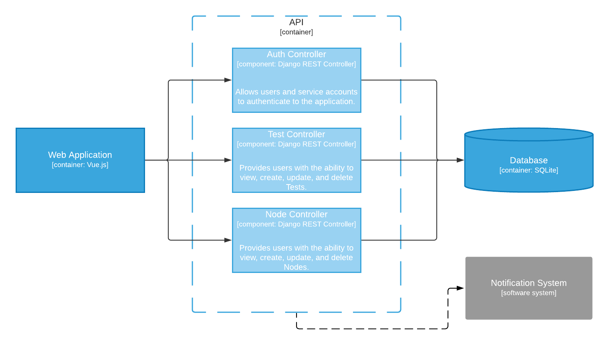

# User Stories
- As a **Viewer**, I want to **view historical Tests** so I can **analyze a network's bandwidth over time**.
  - The Tests page includes an interface for viewing historical Tests.
    - The Historical Test Interface is viewable by users with the Viewer role.
    - The Historical Test Interface includes elements that support the searching and filtering of historical Tests.
    - The Historical Test Interface updates as new search/filter criteria is submitted.
- As an **Executor**, I want to **execute ad-hoc and scheduled Tests** so I can **analyze a network's real-time bandwidth**.
  - The Tests page includes an interface for creating tests.
    - The Create Test Interface is viewable by users with the Executor role.
    - The Create Test Interface includes a form with the following fields:
      - Description
      - Node
      - Schedule
    - Upon validation of form fields, the Create Test Interface allows a user to submit the form.
    - The page submits a request to the backend API for creation of the Test in the Geronimo DB.
    - Upon successful Test creation, the Create Test Interface informs the user of successful creation and indicates that they will receive confirmation via the user's preferred communication channel.
  - The backend API manages a schedule for Test execution.
    - The backend API validates Test arguments.
    - During creation of a Test, the backend API schedules the Test based on the user's request.
    - Upon successful Test creation, the backend API generates and sends a notification to the user's preferred communication channel.
    - The backend API returns a response indicating whether the Test was successfully created and scheduled.
    - Upon Test execution, the backend API generates and sends a notification to the test creator's preferred communication channel with results of the execution.
- As an **Administrator**, I want to **manage application Users and their access** so I can **grant and revoke access to the application based on User needs**.
  - The User Management page includes an interface for managing User access.
    - The User Access Management Interface is viewable by users with the Administrator role and allows the three following interactions for the creation/updating/deletion of a User:
    1) Upon clicking a 'Create User' button, the User Access Management Interface presents a form that includes fields necessary for User creation.
    2) Upon selection of an existing User, the User Access Management Interface presents a form that is populated with a User's current attributes.
    - The User form includes the following attributes:
      - Name
      - User ID
      - Roles
      - Password
    - Upon validation of form fields, the User Access Management Interface allows a user to submit the User form.
    3) Upon clicking a 'Delete User' button, the User Access Management Interface presents a form for confirmation of User deletion.
    - The page submits a request to the backend API for the creation/updating/deletion of a User.
    - The backend API validates User arguments and updates the Geronimo DB based on the user's request.
    - The backend API returns a response indicating whether the User was successfully created/updated/deleted.
    - Upon the successful creation/updating/deletion of a User, the User Access Management Interface informs the user of successful request.
  - Changes made to User access via the User Access Management Interface apply to all current and future user sessions.

# Mis-User Stories
- As an **adversary performing pre-attack reconnaissance**, I want to **view historical Tests** so I can **gather information about the internal network**.
  - The Historical Test Interface is viewable by users with the Viewer role.
    - An adversary performing pre-attack reconnaissance is forced to authenticate with an existing user account.*
- As an **adversary aiming to degrade system availability**, I want to **execute excessive Tests** so I can **congest the server's network interface (DoS)**.
  - The Create Test Interface is viewable by users with the Executor role.
    - An adversary aiming to degrade system availability is forced to authenticate with an existing user account.*
  - The schedule manager limits test scheduling by parameters defined in the Geronimo configuration:
    - concurrent (default=2): The number of Tests that may be in an execution state at any time.
    - interval (default=5m): The minimum time span to exist between any two scheduled tests, unless explicitly defined.

*\* Password standards enforced by Geronimo follow the recommendations defined in [NIST SP 800-63B](https://pages.nist.gov/800-63-3/sp800-63b.html).*

# Diagrams

## Design Mockups
### Home

### Nodes

### Tests

### Users

## C4 Architecture Diagrams

### Context

### Container

### Component

